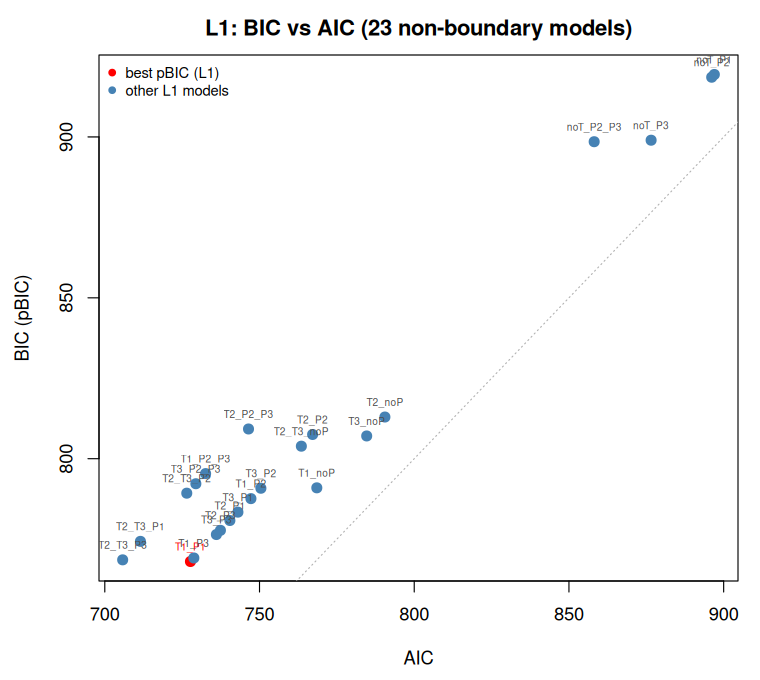
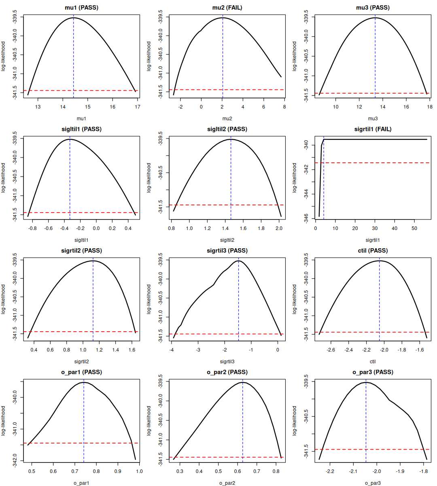
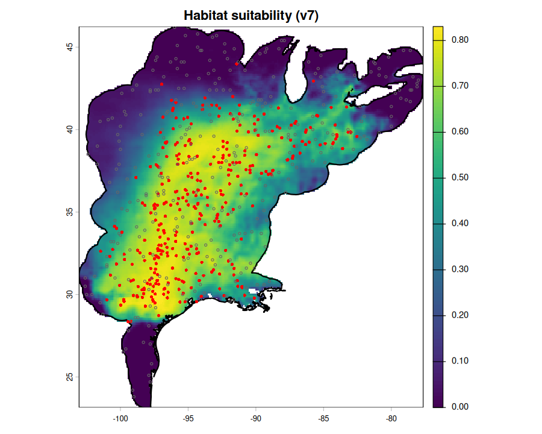
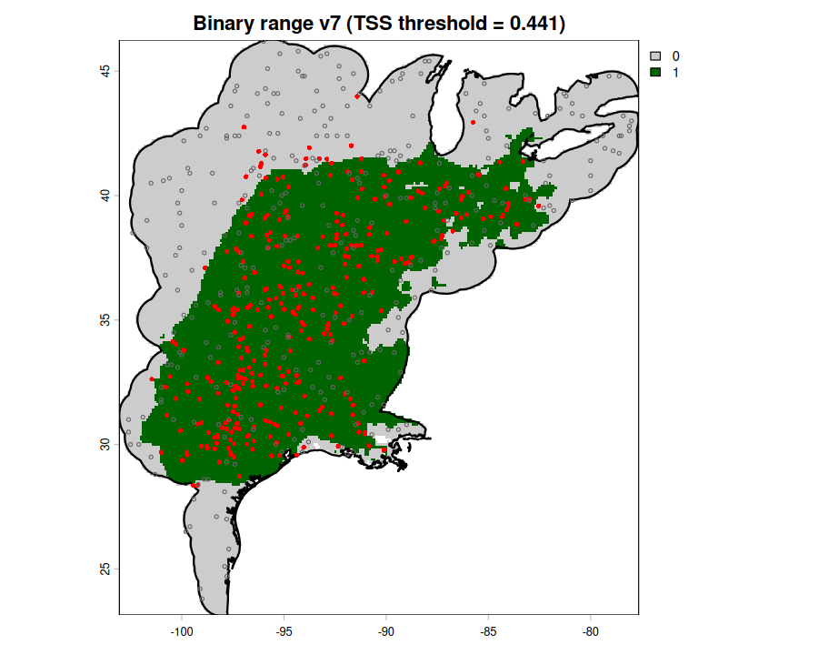

# xsdm v6 — Model selection report (Algorithm2)

**Species:** *Acris blanchardi*

This report documents, step by step, the literal Algorithm2 selection rules
applied to this species. Each phase (L1–L4) includes the rule itself and
the complete list of models with their classification.

**Definition of model success:** a model has `status == "success"` when the optimizer (`optimize_likelihood`) converged and returned a finite best parameter vector. Models that fail to converge are marked `failed`; models with fewer than 3 presences are marked `too_few_presences`. Only successful models receive a pBIC and enter the L1 ranking.

## Data and units

- Species directory: `/home/a474r867/work/xsdm_1000_sp_M_v2/outputs_smoke/Acris_blanchardi`
- Sample size: 655
- Maximum variables per model: 3
- Tau (τ): 25.9385
- L2 threshold: best L1 + τ = 793.9797
- Ω threshold: 782.7986
- Temperature variables are in degrees Celsius (converted from ERA5Land Kelvin); precipitation variables are in mm.
- Each model RDS stores the per-variable `scale_factors` applied during fitting.

## IUCN range and presence points

*IUCN range figure not available.*

## Literal selection rules (Algorithm2)

1. Fit all 23 non-boundary L1 models and rank them by pBIC.
2. Expand the L1 models with pBIC ≤ best_L1 + τ to their boundary versions.
3. Form L3 = L1 ∪ L2, rank by pBIC, and select the first well-behaved model
   (Flags A and B both pass). That model is M_Ω.
4. Expand boundary models in the intermediate pBIC band [best_L1 + τ, Ω + τ].

## Phase L1 — 23 non-boundary models

Rule: fit the 23 non-boundary models and rank them by ascending pBIC.

| # | Model | Variables | pBIC | logLik | n_free | status |
|---|-------|-----------|------|--------|--------|--------|
| 1 | T1_P1 ≤τ | T1+P1 | 768.0 | -354.840 | 9 | success |
| 2 | T2_T3_P3 ≤τ | T2+T3+P3 | 768.6 | -338.888 | 14 | success |
| 3 | T1_P3 ≤τ | T1+P3 | 769.1 | -355.391 | 9 | success |
| 4 | T2_T3_P1 ≤τ | T2+T3+P1 | 774.3 | -341.760 | 14 | success |
| 5 | T3_P3 ≤τ | T3+P3 | 776.4 | -359.033 | 9 | success |
| 6 | T2_P3 ≤τ | T2+P3 | 777.7 | -359.684 | 9 | success |
| 7 | T2_P1 ≤τ | T2+P1 | 780.8 | -361.213 | 9 | success |
| 8 | T3_P1 ≤τ | T3+P1 | 783.4 | -362.512 | 9 | success |
| 9 | T1_P2 ≤τ | T1+P2 | 787.6 | -364.614 | 9 | success |
| 10 | T2_T3_P2 ≤τ | T2+T3+P2 | 789.3 | -349.247 | 14 | success |
| 11 | T3_P2 ≤τ | T3+P2 | 790.8 | -366.225 | 9 | success |
| 12 | T1_noP ≤τ | T1 | 790.9 | -379.259 | 5 | success |
| 13 | T3_P2_P3 ≤τ | T3+P2+P3 | 792.2 | -350.715 | 14 | success |
| 14 | T1_P2_P3 | T1+P2+P3 | 795.4 | -352.292 | 14 | success |
| 15 | T2_T3_noP | T2+T3 | 803.9 | -372.762 | 9 | success |
| 16 | T3_noP | T3 | 807.1 | -387.320 | 5 | success |
| 17 | T2_P2 | T2+P2 | 807.5 | -374.580 | 9 | success |
| 18 | T2_P2_P3 | T2+P2+P3 | 809.2 | -359.223 | 14 | success |
| 19 | T2_noP | T2 | 812.9 | -390.262 | 5 | success |
| 20 | noT_P2_P3 | P2+P3 | 898.5 | -420.075 | 9 | success |
| 21 | noT_P3 | P3 | 899.0 | -433.277 | 5 | success |
| 22 | noT_P2 | P2 | 918.6 | -443.065 | 5 | success |
| 23 | noT_P1 | P1 | 919.4 | -443.492 | 5 | success |

*(The `≤τ` marker identifies models eligible for boundary expansion in L2.)*
**Success** here means `status == "success"`: the optimizer (`optimize_likelihood`) converged and returned a finite best parameter vector; `failed` and `too_few_presences` models do not enter the pBIC ranking.

### BIC vs AIC (L1)

*Each point is one non-boundary L1 model. BIC = −2·logLik + n_free·log(n) (pBIC); AIC = −2·logLik + 2·n_free. The red point is the smallest pBIC.*

## Phase L2 — boundary models for eligible L1 fits

Rule: expand the L1 models with **pBIC ≤ best_L1 + τ = 794.0**.
**Eligible L1 models:** 13 (T1_noP, T1_P1, T1_P2, T1_P3, T2_P1, T2_P3, T2_T3_P1, T2_T3_P2, T2_T3_P3, T3_P1, T3_P2_P3, T3_P2, T3_P3)

| Boundary model | pBIC | logLik | n_free | status |
|---------------|------|--------|--------|--------|
| T2_T3_P3__bd_pd1_sigR1 | 756.9 | -339.522 | 12 | success |
| T2_T3_P3__bd_pd1_sigL3 | 756.9 | -339.522 | 12 | success |
| T2_T3_P3__bd_pd1_sigL1 | 756.9 | -339.522 | 12 | success |
| T2_T3_P3__bd_pd1_sigR3 | 756.9 | -339.522 | 12 | success |
| T2_T3_P3__bd_pd1_sigL2 | 756.9 | -339.522 | 12 | success |
| T2_T3_P3__bd_pd1_sigR2 | 756.9 | -339.522 | 12 | success |
| T2_T3_P3__bd_sigL2 | 762.1 | -338.888 | 13 | success |
| T2_T3_P3__bd_sigR3 | 762.1 | -338.888 | 13 | success |
| T2_T3_P3__bd_sigL3 | 762.1 | -338.888 | 13 | success |
| T2_T3_P3__bd_sigR1 | 762.1 | -338.888 | 13 | success |
| T2_T3_P3__bd_sigR2 | 762.1 | -338.888 | 13 | success |
| T2_T3_P3__bd_sigL1 | 762.1 | -338.888 | 13 | success |
| T2_T3_P1__bd_pd1_sigR2 | 762.3 | -342.262 | 12 | success |
| T2_T3_P1__bd_pd1_sigL3 | 762.3 | -342.262 | 12 | success |
| T2_T3_P1__bd_pd1_sigR3 | 762.3 | -342.262 | 12 | success |
| T2_T3_P1__bd_pd1_sigL1 | 762.3 | -342.262 | 12 | success |
| T2_T3_P1__bd_pd1_sigR1 | 762.3 | -342.262 | 12 | success |
| T2_T3_P3__bd_pd1 | 763.3 | -339.522 | 13 | success |
| T1_P1__bd_pd1 | 766.2 | -357.152 | 8 | success |
| T1_P1__bd_pd1_sigL2 | 767.5 | -361.072 | 7 | success |
| T1_P1__bd_pd1_sigR1 | 767.5 | -361.072 | 7 | success |
| T1_P1__bd_pd1_sigL1 | 767.5 | -361.072 | 7 | success |
| T1_P1__bd_pd1_sigR2 | 767.5 | -361.072 | 7 | success |
| T2_T3_P1__bd_sigL2 | 768.4 | -342.034 | 13 | success |
| T2_T3_P1__bd_sigR3 | 768.4 | -342.034 | 13 | success |
| T2_T3_P1__bd_sigR1 | 768.4 | -342.034 | 13 | success |
| T2_T3_P1__bd_pd1 | 768.4 | -342.049 | 13 | success |
| T2_T3_P1__bd_sigR2 | 768.7 | -342.184 | 13 | success |
| T2_T3_P1__bd_sigL1 | 768.8 | -342.262 | 13 | success |
| T2_P1__bd_pd1_sigR1 | 769.8 | -362.225 | 7 | success |
| T2_P1__bd_pd1_sigR2 | 769.8 | -362.225 | 7 | success |
| T2_P1__bd_pd1_sigL2 | 769.8 | -362.225 | 7 | success |
| T2_P1__bd_pd1_sigL1 | 769.8 | -362.225 | 7 | success |
| T1_P3__bd_pd1 | 772.5 | -360.333 | 8 | success |
| T1_P1__bd_sigL1 | 772.7 | -360.420 | 8 | success |
| T1_P1__bd_sigR1 | 772.7 | -360.420 | 8 | success |
| T1_P1__bd_sigR2 | 772.7 | -360.420 | 8 | success |
| T1_P1__bd_sigL2 | 772.7 | -360.420 | 8 | success |
| T3_P3__bd_sigR1 | 773.3 | -360.735 | 8 | success |
| T3_P3__bd_sigL1 | 773.3 | -360.735 | 8 | success |
| T3_P3__bd_sigR2 | 773.4 | -360.738 | 8 | success |
| T1_P3__bd_sigR2 | 774.3 | -361.221 | 8 | success |
| T1_P3__bd_sigR1 | 774.3 | -361.221 | 8 | success |
| T1_P3__bd_sigL1 | 774.3 | -361.221 | 8 | success |
| T1_P3__bd_sigL2 | 774.3 | -361.221 | 8 | success |
| T2_P1__bd_sigL1 | 774.3 | -361.226 | 8 | success |
| T2_P1__bd_sigL2 | 774.3 | -361.226 | 8 | success |
| T2_P1__bd_sigR1 | 774.3 | -361.226 | 8 | success |
| T2_P1__bd_sigR2 | 774.3 | -361.226 | 8 | success |
| T3_P3__bd_sigL2 | 774.7 | -361.387 | 8 | success |
| T2_T3_P1__bd_pd1_sigL2 | 774.9 | -348.521 | 12 | success |
| T2_P3__bd_sigR1 | 776.2 | -362.137 | 8 | success |
| T2_P3__bd_sigL2 | 776.2 | -362.137 | 8 | success |
| T2_P3__bd_sigR2 | 776.2 | -362.137 | 8 | success |
| T2_P3__bd_sigL1 | 776.2 | -362.137 | 8 | success |
| T2_T3_P2__bd_pd1_sigR1 | 776.3 | -349.247 | 12 | success |
| T2_T3_P2__bd_pd1_sigR2 | 776.3 | -349.247 | 12 | success |
| T2_T3_P2__bd_pd1_sigL2 | 776.3 | -349.247 | 12 | success |
| T2_T3_P2__bd_pd1_sigL3 | 776.3 | -349.247 | 12 | success |
| T2_T3_P2__bd_pd1_sigL1 | 776.3 | -349.247 | 12 | success |
| T2_P1__bd_pd1 | 776.3 | -362.225 | 8 | success |
| T2_P3__bd_pd1_sigR1 | 776.9 | -365.773 | 7 | success |
| T2_P3__bd_pd1_sigR2 | 776.9 | -365.773 | 7 | success |
| T2_P3__bd_pd1_sigL1 | 776.9 | -365.773 | 7 | success |
| T2_P3__bd_pd1_sigL2 | 776.9 | -365.773 | 7 | success |
| T2_T3_P1__bd_sigL3 | 778.2 | -346.926 | 13 | success |
| T3_P1__bd_pd1 | 778.4 | -363.280 | 8 | success |
| T3_P3__bd_pd1 | 778.6 | -363.351 | 8 | success |
| T2_P3__bd_pd1 | 778.7 | -363.402 | 8 | success |
| T1_P3__bd_pd1_sigL2 | 779.9 | -367.231 | 7 | success |
| T1_P3__bd_pd1_sigR2 | 779.9 | -367.231 | 7 | success |
| T1_P3__bd_pd1_sigL1 | 779.9 | -367.231 | 7 | success |
| T1_P3__bd_pd1_sigR1 | 779.9 | -367.231 | 7 | success |
| T2_T3_P2__bd_pd1_sigR3 | 780.3 | -351.238 | 12 | success |
| T1_P2__bd_sigL1 | 781.1 | -364.592 | 8 | success |
| T1_P2__bd_sigR2 | 781.1 | -364.614 | 8 | success |
| T1_P2__bd_sigR1 | 781.1 | -364.614 | 8 | success |
| T1_P2__bd_sigL2 | 781.1 | -364.614 | 8 | success |
| T3_P2_P3__bd_sigL2 | 781.2 | -348.472 | 13 | success |
| T2_T3_P2__bd_pd1 | 782.8 | -349.247 | 13 | success |
| T2_T3_P2__bd_sigR2 | 782.8 | -349.247 | 13 | success |
| T2_T3_P2__bd_sigR3 | 782.8 | -349.247 | 13 | success |
| T2_T3_P2__bd_sigL2 | 782.8 | -349.247 | 13 | success |
| T2_T3_P2__bd_sigR1 | 782.8 | -349.247 | 13 | success |
| T3_P1__bd_pd1_sigL2 | 784.7 | -369.642 | 7 | success |
| T3_P1__bd_pd1_sigR1 | 784.7 | -369.642 | 7 | success |
| T3_P1__bd_pd1_sigL1 | 784.7 | -369.642 | 7 | success |
| T3_P1__bd_pd1_sigR2 | 784.7 | -369.642 | 7 | success |
| T3_P2__bd_sigR1 | 785.0 | -366.561 | 8 | success |
| T3_P2__bd_sigL1 | 785.0 | -366.561 | 8 | success |
| T3_P2__bd_sigR2 | 785.0 | -366.561 | 8 | success |
| T3_P2__bd_sigL2 | 785.0 | -366.561 | 8 | success |
| T3_P2_P3__bd_pd1_sigL2 | 785.5 | -353.846 | 12 | success |
| T3_P2_P3__bd_pd1_sigR2 | 785.6 | -353.896 | 12 | success |
| T1_P2__bd_pd1_sigL1 | 786.0 | -370.305 | 7 | success |
| T1_P2__bd_pd1_sigL2 | 786.0 | -370.305 | 7 | success |
| T1_P2__bd_pd1_sigR1 | 786.0 | -370.305 | 7 | success |
| T1_P2__bd_pd1_sigR2 | 786.0 | -370.305 | 7 | success |
| T3_P2_P3__bd_pd1_sigL3 | 786.3 | -354.260 | 12 | success |
| T3_P2_P3__bd_sigL3 | 786.4 | -351.048 | 13 | success |
| T3_P2_P3__bd_pd1_sigL1 | 786.7 | -354.465 | 12 | success |
| T2_T3_P2__bd_sigL1 | 786.8 | -351.238 | 13 | success |
| T2_T3_P2__bd_sigL3 | 786.8 | -351.238 | 13 | success |
| T3_P2_P3__bd_sigR1 | 787.2 | -351.431 | 13 | success |
| T3_P2_P3__bd_sigL1 | 787.2 | -351.431 | 13 | success |
| T3_P2_P3__bd_sigR3 | 787.2 | -351.431 | 13 | success |
| T3_P2_P3__bd_sigR2 | 787.2 | -351.431 | 13 | success |
| T3_P3__bd_pd1_sigL2 | 788.1 | -371.376 | 7 | success |
| T3_P3__bd_pd1_sigL1 | 788.1 | -371.376 | 7 | success |
| T3_P3__bd_pd1_sigR2 | 788.1 | -371.376 | 7 | success |
| T3_P3__bd_pd1_sigR1 | 788.1 | -371.376 | 7 | success |
| T3_P2_P3__bd_pd1 | 788.4 | -352.070 | 13 | success |
| T3_P2_P3__bd_pd1_sigR1 | 789.3 | -355.727 | 12 | success |
| T3_P2_P3__bd_pd1_sigR3 | 789.3 | -355.727 | 12 | success |
| T1_P2__bd_pd1 | 790.5 | -369.318 | 8 | success |
| T3_P1__bd_sigR2 | 790.9 | -369.498 | 8 | success |
| T3_P1__bd_sigL2 | 790.9 | -369.498 | 8 | success |
| T3_P1__bd_sigL1 | 790.9 | -369.498 | 8 | success |
| T3_P1__bd_sigR1 | 790.9 | -369.498 | 8 | success |
| T3_P2__bd_pd1_sigR2 | 791.1 | -372.860 | 7 | success |
| T3_P2__bd_pd1_sigR1 | 791.1 | -372.860 | 7 | success |
| T3_P2__bd_pd1_sigL1 | 791.1 | -372.860 | 7 | success |
| T3_P2__bd_pd1_sigL2 | 791.1 | -372.860 | 7 | success |
| T3_P2__bd_pd1 | 796.5 | -372.297 | 8 | success |
| T1_noP__bd_pd1_sigR1 | 797.3 | -388.922 | 3 | success |
| T1_noP__bd_pd1 | 799.8 | -386.937 | 4 | success |
| T1_noP__bd_sigR1 | 803.4 | -388.722 | 4 | success |
| T2_noP__bd_pd1 | 806.5 | -390.262 | 4 | success |
| T1_noP__bd_pd1_sigL1 | 915.0 | -447.794 | 3 | success |
| T1_noP__bd_sigL1 | 919.0 | -446.515 | 4 | success |

## Phase L3 — union of L1 ∪ L2 and the well-behaved scan

Rule: combine L1 and L2, sort by ascending pBIC, and accept the **first**
model with both Flag A and Flag B passing. That model is M_Ω.

| # | Model | pBIC | well-behaved | Flag A | Flag B | cond no. | n_conv |
|---|-------|------|--------------|--------|--------|---------|--------|
| 1 | T2_T3_P3__bd_pd1_sigR1_sigL3 | 750.4 | no | ✓ | ✗ | Inf | 13 |
| 2 | T2_T3_P3__bd_pd1_sigR2_sigL3 | 750.4 | no | ✓ | ✗ | Inf | 3 |
| 3 | T2_T3_P3__bd_pd1_sigR1 | 756.9 | no | ✓ | ✗ | Inf | 28 |
| 4 | T2_T3_P3__bd_pd1_sigL3 | 756.9 | yes ✓ | ✓ | ✓ | 3.18e+05 | 25 |
| 5 | T2_T3_P3__bd_pd1_sigL1 | 756.9 | no | ✓ | ✗ | Inf | 19 |
| 6 | T2_T3_P3__bd_pd1_sigR3 | 756.9 | no | ✓ | ✗ | Inf | 28 |
| 7 | T2_T3_P3__bd_pd1_sigL2 | 756.9 | no | ✓ | ✗ | Inf | 30 |
| 8 | T2_T3_P3__bd_pd1_sigR2 | 756.9 | no | ✓ | ✗ | Inf | 17 |
| 9 | T2_T3_P3__bd_sigL2 | 762.1 | no | ✓ | ✗ | Inf | 12 |
| 10 | T2_T3_P3__bd_sigR3 | 762.1 | no | ✓ | ✗ | Inf | 6 |
| 11 | T2_T3_P3__bd_sigL3 | 762.1 | yes ✓ | ✓ | ✓ | 1.61e+04 | 9 |
| 12 | T2_T3_P3__bd_sigR1 | 762.1 | no | ✓ | ✗ | Inf | 7 |
| 13 | T2_T3_P3__bd_sigR2 | 762.1 | no | ✓ | ✗ | Inf | 8 |
| 14 | T2_T3_P3__bd_sigL1 | 762.1 | no | ✓ | ✗ | Inf | 11 |
| 15 | T2_T3_P1__bd_pd1_sigR2 | 762.3 | no | ✓ | ✗ | Inf | 3 |
| 16 | T2_T3_P1__bd_pd1_sigL3 | 762.3 | no | ✗ | ✗ | Inf | 1 |
| 17 | T2_T3_P1__bd_pd1_sigR3 | 762.3 | no | ✗ | ✗ | Inf | 1 |
| 18 | T2_T3_P1__bd_pd1_sigL1 | 762.3 | no | ✗ | ✗ | Inf | 1 |
| 19 | T2_T3_P1__bd_pd1_sigR1 | 762.3 | no | ✗ | ✗ | Inf | 1 |
| 20 | T2_T3_P3__bd_pd1 | 763.3 | no | ✓ | ✗ | Inf | 42 |
| 21 | T1_P1__bd_pd1 | 766.2 | no | ✓ | ✗ | 1.37e+06 | 43 |
| 22 | T1_P1__bd_pd1_sigL2 | 767.5 | no | ✓ | ✗ | Inf | 9 |
| 23 | T1_P1__bd_pd1_sigR1 | 767.5 | yes ✓ | ✓ | ✓ | 4.06e+05 | 10 |
| 24 | T1_P1__bd_pd1_sigL1 | 767.5 | no | ✓ | ✗ | Inf | 11 |
| 25 | T1_P1__bd_pd1_sigR2 | 767.5 | yes ✓ | ✓ | ✓ | 3.90e+05 | 10 |
| 26 | T1_P1 | 768.0 | no | ✓ | ✗ | 1.79e+06 | 39 |
| 27 | T2_T3_P1__bd_sigL2 | 768.4 | no | ✗ | ✗ | Inf | 1 |
| 28 | T2_T3_P1__bd_sigR3 | 768.4 | no | ✗ | ✗ | 5.03e+06 | 1 |
| 29 | T2_T3_P1__bd_sigR1 | 768.4 | no | ✗ | ✗ | Inf | 1 |
| 30 | T2_T3_P1__bd_pd1 | 768.4 | no | ✓ | ✗ | Inf | 13 |
| 31 | T2_T3_P3 | 768.6 | no | ✓ | ✗ | Inf | 25 |
| 32 | T2_T3_P1__bd_sigR2 | 768.7 | no | ✗ | ✗ | Inf | 1 |
| 33 | T2_T3_P1__bd_sigL1 | 768.8 | no | ✗ | ✗ | Inf | 1 |
| 34 | T1_P3 | 769.1 | yes ✓ | ✓ | ✓ | 3.61e+03 | 47 |
| 35 | T2_P1__bd_pd1_sigR1 | 769.8 | yes ✓ | ✓ | ✓ | 1.41e+03 | 15 |
| 36 | T2_P1__bd_pd1_sigR2 | 769.8 | yes ✓ | ✓ | ✓ | 1.40e+03 | 14 |
| 37 | T2_P1__bd_pd1_sigL2 | 769.8 | yes ✓ | ✓ | ✓ | 1.42e+03 | 14 |
| 38 | T2_P1__bd_pd1_sigL1 | 769.8 | yes ✓ | ✓ | ✓ | 1.42e+03 | 9 |
| 39 | T1_P3__bd_pd1 | 772.5 | yes ✓ | ✓ | ✓ | 3.43e+03 | 20 |
| 40 | T1_P1__bd_sigL1 | 772.7 | yes ✓ | ✓ | ✓ | 6.37e+05 | 7 |
| 41 | T1_P1__bd_sigR1 | 772.7 | yes ✓ | ✓ | ✓ | 7.09e+05 | 11 |
| 42 | T1_P1__bd_sigR2 | 772.7 | no | ✓ | ✗ | Inf | 5 |
| 43 | T1_P1__bd_sigL2 | 772.7 | yes ✓ | ✓ | ✓ | 6.92e+05 | 9 |
| 44 | T2_T3_P3__bd_pd1_sigR1_sigR2_sigL3 | 773.2 | no | ✗ | ✗ | Inf | 1 |
| 45 | T3_P3__bd_sigR1 | 773.3 | no | ✗ | ✗ | Inf | 1 |
| 46 | T3_P3__bd_sigL1 | 773.3 | no | ✗ | ✗ | Inf | 1 |
| 47 | T3_P3__bd_sigR2 | 773.4 | no | ✗ | ✗ | Inf | 1 |
| 48 | T2_T3_P1 | 774.3 | no | ✓ | ✗ | Inf | 10 |
| 49 | T1_P3__bd_sigR2 | 774.3 | yes ✓ | ✓ | ✓ | 5.28e+04 | 21 |
| 50 | T1_P3__bd_sigR1 | 774.3 | yes ✓ | ✓ | ✓ | 8.20e+04 | 18 |
| 51 | T1_P3__bd_sigL1 | 774.3 | yes ✓ | ✓ | ✓ | 5.20e+04 | 11 |
| 52 | T1_P3__bd_sigL2 | 774.3 | yes ✓ | ✓ | ✓ | 5.20e+04 | 19 |
| 53 | T2_P1__bd_sigL1 | 774.3 | yes ✓ | ✓ | ✓ | 2.41e+03 | 11 |
| 54 | T2_P1__bd_sigL2 | 774.3 | yes ✓ | ✓ | ✓ | 2.43e+03 | 8 |
| 55 | T2_P1__bd_sigR1 | 774.3 | yes ✓ | ✓ | ✓ | 2.43e+03 | 17 |
| 56 | T2_P1__bd_sigR2 | 774.3 | yes ✓ | ✓ | ✓ | 2.45e+03 | 4 |
| 57 | T3_P3__bd_sigL2 | 774.7 | no | ✓ | ✗ | Inf | 12 |
| 58 | T2_T3_P1__bd_pd1_sigL2 | 774.9 | no | ✗ | ✗ | Inf | 1 |
| 59 | T2_P3__bd_sigR1 | 776.2 | yes ✓ | ✓ | ✓ | 1.01e+04 | 14 |
| 60 | T2_P3__bd_sigL2 | 776.2 | yes ✓ | ✓ | ✓ | 7.88e+03 | 18 |
| 61 | T2_P3__bd_sigR2 | 776.2 | yes ✓ | ✓ | ✓ | 1.03e+04 | 19 |
| 62 | T2_P3__bd_sigL1 | 776.2 | yes ✓ | ✓ | ✓ | 1.03e+04 | 7 |
| 63 | T2_T3_P2__bd_pd1_sigR1 | 776.3 | yes ✓ | ✓ | ✓ | 2.12e+05 | 4 |
| 64 | T2_T3_P2__bd_pd1_sigR2 | 776.3 | no | ✓ | ✗ | 1.41e+06 | 3 |
| 65 | T2_T3_P2__bd_pd1_sigL2 | 776.3 | no | ✗ | ✓ | 1.35e+05 | 2 |
| 66 | T2_T3_P2__bd_pd1_sigL3 | 776.3 | no | ✗ | ✗ | Inf | 1 |
| 67 | T2_T3_P2__bd_pd1_sigL1 | 776.3 | no | ✗ | ✗ | Inf | 1 |
| 68 | T2_P1__bd_pd1 | 776.3 | no | ✓ | ✗ | 4.33e+12 | 38 |
| 69 | T3_P3 | 776.4 | no | ✓ | ✗ | 6.48e+06 | 22 |
| 70 | T2_P3__bd_pd1_sigR1 | 776.9 | yes ✓ | ✓ | ✓ | 4.68e+03 | 14 |
| 71 | T2_P3__bd_pd1_sigR2 | 776.9 | yes ✓ | ✓ | ✓ | 4.66e+03 | 13 |
| 72 | T2_P3__bd_pd1_sigL1 | 776.9 | yes ✓ | ✓ | ✓ | 4.14e+03 | 10 |
| 73 | T2_P3__bd_pd1_sigL2 | 776.9 | yes ✓ | ✓ | ✓ | 4.64e+03 | 10 |
| 74 | T2_P3 | 777.7 | yes ✓ | ✓ | ✓ | 7.06e+03 | 35 |
| 75 | T2_T3_P1__bd_sigL3 | 778.2 | no | ✗ | ✗ | Inf | 1 |
| 76 | T3_P1__bd_pd1 | 778.4 | yes ✓ | ✓ | ✓ | 6.17e+05 | 44 |
| 77 | T3_P3__bd_pd1 | 778.6 | no | ✓ | ✗ | Inf | 38 |
| 78 | T2_P3__bd_pd1 | 778.7 | yes ✓ | ✓ | ✓ | 5.40e+03 | 42 |
| 79 | T1_P3__bd_pd1_sigL2 | 779.9 | yes ✓ | ✓ | ✓ | 1.38e+04 | 14 |
| 80 | T1_P3__bd_pd1_sigR2 | 779.9 | yes ✓ | ✓ | ✓ | 1.30e+04 | 13 |
| 81 | T1_P3__bd_pd1_sigL1 | 779.9 | yes ✓ | ✓ | ✓ | 1.35e+04 | 10 |
| 82 | T1_P3__bd_pd1_sigR1 | 779.9 | yes ✓ | ✓ | ✓ | 1.29e+04 | 11 |
| 83 | T2_T3_P2__bd_pd1_sigR3 | 780.3 | no | ✓ | ✗ | Inf | 11 |
| 84 | T2_P1 | 780.8 | yes ✓ | ✓ | ✓ | 8.87e+03 | 29 |
| 85 | T1_P2__bd_sigL1 | 781.1 | no | ✗ | ✗ | Inf | 1 |
| 86 | T1_P2__bd_sigR2 | 781.1 | yes ✓ | ✓ | ✓ | 4.75e+05 | 18 |
| 87 | T1_P2__bd_sigR1 | 781.1 | yes ✓ | ✓ | ✓ | 3.62e+05 | 13 |
| 88 | T1_P2__bd_sigL2 | 781.1 | no | ✓ | ✗ | Inf | 15 |
| 89 | T3_P2_P3__bd_sigL2 | 781.2 | no | ✗ | ✗ | Inf | 1 |
| 90 | T2_T3_P2__bd_pd1 | 782.8 | no | ✓ | ✗ | Inf | 20 |
| 91 | T2_T3_P2__bd_sigR2 | 782.8 | no | ✓ | ✗ | Inf | 4 |
| 92 | T2_T3_P2__bd_sigR3 | 782.8 | no | ✗ | ✗ | Inf | 1 |
| 93 | T2_T3_P2__bd_sigL2 | 782.8 | no | ✗ | ✗ | Inf | 2 |
| 94 | T2_T3_P2__bd_sigR1 | 782.8 | no | ✗ | ✗ | Inf | 2 |
| 95 | T3_P1 | 783.4 | yes ✓ | ✓ | ✓ | 6.80e+05 | 41 |
| 96 | T3_P1__bd_pd1_sigL2 | 784.7 | yes ✓ | ✓ | ✓ | 1.87e+05 | 13 |
| 97 | T3_P1__bd_pd1_sigR1 | 784.7 | yes ✓ | ✓ | ✓ | 1.87e+05 | 12 |
| 98 | T3_P1__bd_pd1_sigL1 | 784.7 | yes ✓ | ✓ | ✓ | 1.88e+05 | 8 |
| 99 | T3_P1__bd_pd1_sigR2 | 784.7 | yes ✓ | ✓ | ✓ | 1.78e+05 | 10 |
| 100 | T3_P2__bd_sigR1 | 785.0 | no | ✓ | ✗ | Inf | 12 |
| 101 | T3_P2__bd_sigL1 | 785.0 | no | ✓ | ✗ | Inf | 17 |
| 102 | T3_P2__bd_sigR2 | 785.0 | no | ✓ | ✗ | 1.39e+09 | 15 |
| 103 | T3_P2__bd_sigL2 | 785.0 | no | ✓ | ✗ | Inf | 10 |
| 104 | T3_P2_P3__bd_pd1_sigL2 | 785.5 | no | ✗ | ✗ | Inf | 1 |
| 105 | T3_P2_P3__bd_pd1_sigR2 | 785.6 | no | ✗ | ✗ | Inf | 1 |
| 106 | T1_P2__bd_pd1_sigL1 | 786.0 | yes ✓ | ✓ | ✓ | 2.88e+04 | 8 |
| 107 | T1_P2__bd_pd1_sigL2 | 786.0 | yes ✓ | ✓ | ✓ | 3.97e+05 | 14 |
| 108 | T1_P2__bd_pd1_sigR1 | 786.0 | no | ✓ | ✗ | Inf | 11 |
| 109 | T1_P2__bd_pd1_sigR2 | 786.0 | yes ✓ | ✓ | ✓ | 2.88e+04 | 10 |
| 110 | T3_P2_P3__bd_pd1_sigL3 | 786.3 | no | ✗ | ✗ | Inf | 1 |
| 111 | T3_P2_P3__bd_sigL3 | 786.4 | no | ✗ | ✗ | Inf | 1 |
| 112 | T3_P2_P3__bd_pd1_sigL1 | 786.7 | no | ✗ | ✗ | Inf | 2 |
| 113 | T2_T3_P2__bd_sigL1 | 786.8 | no | ✗ | ✗ | Inf | 2 |
| 114 | T2_T3_P2__bd_sigL3 | 786.8 | no | ✗ | ✗ | 4.52e+09 | 1 |
| 115 | T3_P2_P3__bd_sigR1 | 787.2 | no | ✓ | ✗ | Inf | 4 |
| 116 | T3_P2_P3__bd_sigL1 | 787.2 | no | ✓ | ✗ | Inf | 8 |
| 117 | T3_P2_P3__bd_sigR3 | 787.2 | no | ✓ | ✗ | Inf | 4 |
| 118 | T3_P2_P3__bd_sigR2 | 787.2 | no | ✓ | ✗ | Inf | 3 |
| 119 | T1_P2 | 787.6 | no | ✓ | ✗ | 3.26e+15 | 42 |
| 120 | T3_P3__bd_pd1_sigL2 | 788.1 | no | ✓ | ✗ | 1.73e+07 | 14 |
| 121 | T3_P3__bd_pd1_sigL1 | 788.1 | no | ✓ | ✗ | Inf | 10 |
| 122 | T3_P3__bd_pd1_sigR2 | 788.1 | no | ✓ | ✗ | 1.68e+07 | 9 |
| 123 | T3_P3__bd_pd1_sigR1 | 788.1 | no | ✓ | ✗ | 1.07e+07 | 10 |
| 124 | T3_P2_P3__bd_pd1 | 788.4 | no | ✗ | ✗ | Inf | 1 |
| 125 | T3_P2_P3__bd_pd1_sigR1 | 789.3 | no | ✓ | ✗ | Inf | 7 |
| 126 | T3_P2_P3__bd_pd1_sigR3 | 789.3 | no | ✓ | ✗ | Inf | 6 |
| 127 | T2_T3_P2 | 789.3 | no | ✓ | ✗ | Inf | 6 |
| 128 | T1_P2__bd_pd1 | 790.5 | yes ✓ | ✓ | ✓ | 3.97e+04 | 42 |
| 129 | T3_P2 | 790.8 | no | ✗ | ✗ | Inf | 1 |
| 130 | T3_P1__bd_sigR2 | 790.9 | yes ✓ | ✓ | ✓ | 1.99e+05 | 11 |
| 131 | T3_P1__bd_sigL2 | 790.9 | yes ✓ | ✓ | ✓ | 2.26e+05 | 11 |
| 132 | T3_P1__bd_sigL1 | 790.9 | yes ✓ | ✓ | ✓ | 2.31e+05 | 6 |
| 133 | T3_P1__bd_sigR1 | 790.9 | yes ✓ | ✓ | ✓ | 2.13e+05 | 8 |
| 134 | T1_noP | 790.9 | yes ✓ | ✓ | ✓ | 2.64e+04 | 9 |
| 135 | T3_P2__bd_pd1_sigR2 | 791.1 | yes ✓ | ✓ | ✓ | 1.59e+05 | 23 |
| 136 | T3_P2__bd_pd1_sigR1 | 791.1 | yes ✓ | ✓ | ✓ | 1.58e+05 | 17 |
| 137 | T3_P2__bd_pd1_sigL1 | 791.1 | yes ✓ | ✓ | ✓ | 1.58e+05 | 21 |
| 138 | T3_P2__bd_pd1_sigL2 | 791.1 | yes ✓ | ✓ | ✓ | 1.63e+05 | 13 |
| 139 | T3_P2_P3 | 792.2 | no | ✗ | ✗ | Inf | 1 |
| 140 | T1_P2_P3 | 795.4 | no | ✗ | ✗ | Inf | 1 |
| 141 | T3_P2__bd_pd1 | 796.5 | yes ✓ | ✓ | ✓ | 1.01e+05 | 44 |
| 142 | T1_noP__bd_pd1_sigR1 | 797.3 | yes ✓ | ✓ | ✓ | 2.01e+02 | 50 |
| 143 | T1_noP__bd_pd1 | 799.8 | yes ✓ | ✓ | ✓ | 5.41e+02 | 50 |
| 144 | T1_noP__bd_sigR1 | 803.4 | yes ✓ | ✓ | ✓ | 1.93e+04 | 50 |
| 145 | T2_T3_noP | 803.9 | no | ✓ | ✗ | Inf | 4 |
| 146 | T2_noP__bd_pd1 | 806.5 | no | ✓ | ✗ | 3.53e+13 | 50 |
| 147 | T3_noP | 807.1 | no | ✗ | ✗ | Inf | 2 |
| 148 | T2_P2 | 807.5 | no | ✓ | ✗ | Inf | 26 |
| 149 | T2_P2_P3 | 809.2 | no | ✗ | ✗ | Inf | 1 |
| 150 | T2_noP | 812.9 | no | ✓ | ✗ | 1.78e+12 | 46 |
| 151 | noT_P2_P3 | 898.5 | no | ✗ | ✗ | Inf | 1 |
| 152 | noT_P3 | 899.0 | no | ✓ | ✗ | 7.32e+07 | 29 |
| 153 | T1_noP__bd_pd1_sigL1 | 915.0 | yes ✓ | ✓ | ✓ | 8.80e+02 | 49 |
| 154 | noT_P2 | 918.6 | no | ✗ | ✗ | Inf | 1 |
| 155 | T1_noP__bd_sigL1 | 919.0 | no | ✗ | ✗ | Inf | 1 |
| 156 | noT_P1 | 919.4 | no | ✗ | ✗ | Inf | 1 |
*(The scan stops at the first well-behaved model; higher-pBIC models may therefore be left unscanned.)*

**M_Ω (L3):** `T2_T3_P3__bd_pd1_sigL3` — **Ω = 756.9**

## L3 supplementary appendices — per-model diagnostics

### T2_T3_P3__bd_pd1_sigR1 — Appendix A: optimization restarts (Flag A)

| rank | logLik | mu1 | mu2 | mu3 | sigltil1 | sigltil2 | sigltil3 | sigrtil1 | sigrtil2 | sigrtil3 | ctil | pd | o_mat1 | o_mat2 | o_mat3 | o_mat4 | o_mat5 | o_mat6 | o_mat7 | o_mat8 | o_mat9 | dist_to_best |
|---|---|---|---|---|---|---|---|---|---|---|---|---|---|---|---|---|---|---|---|---|---|---|
| 1 | -339.522 | 14.4311 | 2.0641 | 13.3569 | 0.2286 | 3.0771 | 60.4542 |   Inf | 4.3178 | 0.7180 | -2.0535 | 1.0000 | 0.6977 | -0.5459 | 0.4639 | -0.1581 | 0.5142 | 0.8430 | -0.6987 | -0.6615 | 0.2725 | 0.00000000 |
| 2 | -339.522 | 14.4311 | 2.0641 | 13.3569 | 0.2286 | 3.0771 | 60.4542 |   Inf | 4.3178 | 0.7180 | -2.0535 | 1.0000 | 0.6977 | -0.5459 | 0.4639 | -0.1581 | 0.5142 | 0.8430 | -0.6987 | -0.6615 | 0.2725 | 0.00000127 |
| 3 | -339.522 | 14.4311 | 2.0641 | 13.3569 | 0.2286 | 3.0771 | 60.4542 |   Inf | 4.3178 | 0.7180 | -2.0535 | 1.0000 | 0.6977 | -0.5459 | 0.4639 | -0.1581 | 0.5142 | 0.8430 | -0.6987 | -0.6615 | 0.2725 | 0.00000102 |
| 4 | -339.522 | 14.4311 | 2.0641 | 13.3569 | 0.2286 | 3.0771 | 60.4542 |   Inf | 4.3178 | 0.7180 | -2.0535 | 1.0000 | 0.6977 | -0.5459 | 0.4639 | -0.1581 | 0.5142 | 0.8430 | -0.6987 | -0.6615 | 0.2725 | 0.00000226 |
| 5 | -339.522 | 14.4311 | 2.0641 | 13.3569 | 0.2286 | 3.0771 | 60.4543 |   Inf | 4.3178 | 0.7180 | -2.0535 | 1.0000 | 0.6977 | -0.5459 | 0.4639 | -0.1581 | 0.5142 | 0.8430 | -0.6987 | -0.6615 | 0.2725 | 0.00000062 |
| 6 | -339.522 | 14.4311 | 2.0641 | 13.3569 | 0.2286 | 3.0771 | 60.4542 |   Inf | 4.3178 | 0.7180 | -2.0535 | 1.0000 | 0.6977 | -0.5459 | 0.4639 | -0.1581 | 0.5142 | 0.8430 | -0.6987 | -0.6615 | 0.2725 | 0.00000059 |
| 7 | -339.522 | 14.4311 | 2.0641 | 13.3569 | 0.2286 | 3.0771 | 60.4543 |   Inf | 4.3178 | 0.7180 | -2.0535 | 1.0000 | 0.6977 | -0.5459 | 0.4639 | -0.1581 | 0.5142 | 0.8430 | -0.6987 | -0.6615 | 0.2725 | 0.00000047 |
| 8 | -339.522 | 14.4311 | 2.0641 | 13.3569 | 0.2286 | 3.0771 | 60.4542 |   Inf | 4.3178 | 0.7180 | -2.0535 | 1.0000 | 0.6977 | -0.5459 | 0.4639 | -0.1581 | 0.5142 | 0.8430 | -0.6987 | -0.6615 | 0.2725 | 0.00000109 |
| 9 | -339.522 | 14.4311 | 2.0641 | 13.3569 | 0.2286 | 3.0771 | 60.4542 |   Inf | 4.3178 | 0.7180 | -2.0535 | 1.0000 | 0.6977 | -0.5459 | 0.4639 | -0.1581 | 0.5142 | 0.8430 | -0.6987 | -0.6615 | 0.2725 | 0.00000203 |
| 10 | -339.522 | 14.4311 | 2.0641 | 13.3569 | 0.2286 | 3.0771 | 60.4543 |   Inf | 4.3178 | 0.7180 | -2.0535 | 1.0000 | 0.6977 | -0.5459 | 0.4639 | -0.1581 | 0.5142 | 0.8430 | -0.6987 | -0.6615 | 0.2725 | 0.00000170 |

Flag A rule: on the top-3 restarts, logLik range < 0.1 AND max parameter-distance < 0.05 (the table above lists the top-10 restarts for inspection; the decision uses the top 3). This model: ll_range=0.0000, max_pdist=0.0000 → PASS (wb$flag_a). A max_pdist of NA means `dist_between_params` could not be evaluated because a shape parameter saturates to +/-Inf.

### T2_T3_P3__bd_pd1_sigR1 — Appendix B: Hessian eigenvalues (Flag B)

| # | eigenvalue numDeriv::hessian (operative) | eigenvalue (J+Jᵀ)/2 (comparison) |
|---|---:|---:|
| 1 | 8.006e+03 | 6.964e+03 |
| 2 | 6.922e+02 | 6.926e+02 |
| 3 | 4.619e+02 | 4.597e+02 |
| 4 | 1.249e+02 | 1.224e+02 |
| 5 | 1.791e+01 | 2.177e+01 |
| 6 | 1.245e+01 | 1.435e+01 |
| 7 | 2.606e+00 | 3.198e+00 |
| 8 | 1.323e+00 | 1.489e+00 |
| 9 | 9.638e-02 | 1.158e+00 |
| 10 | 5.085e-02 | 2.422e-01 |
| 11 | -2.138e+00 | 8.375e-02 |
| 12 | -6.630e+02 | 4.884e-02 |

numDeriv::hessian (operative): cond =   Inf, n negative = 2, strict Flag B → FAIL
(J+Jᵀ)/2 = jacobian(grad), symmetrized (comparison): cond = 142588.9927, n negative = 0, strict Flag B → PASS, relaxed → PASS
A large negative eigenvalue in the numDeriv::hessian column is a finite-difference artifact in stiff (e.g. rotation `o_par`) directions; the operative Flag B uses the symmetrized numDeriv::hessian. See docs/well_behaved_flag_b_hessian.md.
Hessian method: operative Flag B: symmetrized numDeriv::hessian (Richardson) on the reduced parameter space after fixing saturated boundary parameters; H_bar := (H + t(H))/2; symmetrized Jacobian of the gradient (J + t(J))/2 reported alongside for comparison

### T2_T3_P3__bd_pd1_sigL3 — Appendix A: optimization restarts (Flag A)

| rank | logLik | mu1 | mu2 | mu3 | sigltil1 | sigltil2 | sigltil3 | sigrtil1 | sigrtil2 | sigrtil3 | ctil | pd | o_mat1 | o_mat2 | o_mat3 | o_mat4 | o_mat5 | o_mat6 | o_mat7 | o_mat8 | o_mat9 | dist_to_best |
|---|---|---|---|---|---|---|---|---|---|---|---|---|---|---|---|---|---|---|---|---|---|---|
| 1 | -339.522 | 14.4311 | 2.0641 | 13.3569 | 0.7180 | 4.3178 |   Inf | 60.4542 | 3.0771 | 0.2286 | -2.0535 | 1.0000 | 0.6987 | 0.6615 | -0.2725 | 0.1581 | -0.5142 | -0.8430 | -0.6977 | 0.5459 | -0.4639 | 0.00000000 |
| 2 | -339.522 | 14.4311 | 2.0641 | 13.3569 | 0.7180 | 4.3178 |   Inf | 60.4542 | 3.0771 | 0.2286 | -2.0535 | 1.0000 | 0.6987 | 0.6615 | -0.2725 | 0.1581 | -0.5142 | -0.8430 | -0.6977 | 0.5459 | -0.4639 | 0.00000126 |
| 3 | -339.522 | 14.4311 | 2.0641 | 13.3569 | 0.7180 | 4.3178 |   Inf | 60.4543 | 3.0771 | 0.2286 | -2.0535 | 1.0000 | 0.6987 | 0.6615 | -0.2725 | 0.1581 | -0.5142 | -0.8430 | -0.6977 | 0.5459 | -0.4639 | 0.00000116 |
| 4 | -339.522 | 14.4311 | 2.0641 | 13.3569 | 0.7180 | 4.3178 |   Inf | 60.4542 | 3.0771 | 0.2286 | -2.0535 | 1.0000 | 0.6987 | 0.6615 | -0.2725 | 0.1581 | -0.5142 | -0.8430 | -0.6977 | 0.5459 | -0.4639 | 0.00000128 |
| 5 | -339.522 | 14.4311 | 2.0641 | 13.3569 | 0.7180 | 4.3178 |   Inf | 60.4542 | 3.0771 | 0.2286 | -2.0535 | 1.0000 | 0.6987 | 0.6615 | -0.2725 | 0.1581 | -0.5142 | -0.8430 | -0.6977 | 0.5459 | -0.4639 | 0.00000063 |
| 6 | -339.528 | 14.4362 | 2.0655 | 13.3200 | 0.7213 | 4.3309 |   Inf | 43004.7290 | 3.0782 | 0.2286 | -2.0300 | 1.0000 | 0.6991 | 0.6617 | -0.2707 | 0.1598 | -0.5137 | -0.8429 | -0.6969 | 0.5460 | -0.4649 | 0.04760688 |
| 7 | -339.528 | 14.4362 | 2.0655 | 13.3200 | 0.7213 | 4.3309 | 925306170878358144.0000 |   Inf | 3.0782 | 0.2286 | -2.0300 | 1.0000 | 0.6991 | 0.6617 | -0.2707 | 0.1598 | -0.5137 | -0.8429 | -0.6969 | 0.5460 | -0.4649 | 0.04761528 |
| 8 | -339.528 | 14.4362 | 2.0655 | 13.3200 | 0.7213 | 4.3309 | 283985726148944332161286144.0000 |   Inf | 3.0782 | 0.2286 | -2.0300 | 1.0000 | 0.6991 | 0.6617 | -0.2707 | 0.1598 | -0.5137 | -0.8429 | -0.6969 | 0.5460 | -0.4649 | 0.04761530 |
| 9 | -339.528 | 14.4362 | 2.0655 | 13.3200 | 0.7213 | 4.3309 | 15566005.3896 |   Inf | 3.0782 | 0.2286 | -2.0300 | 1.0000 | 0.6991 | 0.6617 | -0.2707 | 0.1598 | -0.5137 | -0.8429 | -0.6969 | 0.5460 | -0.4649 | 0.04761528 |
| 10 | -339.528 | 14.4362 | 2.0655 | 13.3200 | 0.7213 | 4.3309 | 3763297.8200 |   Inf | 3.0782 | 0.2286 | -2.0300 | 1.0000 | 0.6991 | 0.6617 | -0.2707 | 0.1598 | -0.5137 | -0.8429 | -0.6969 | 0.5460 | -0.4649 | 0.04761528 |

Flag A rule: on the top-3 restarts, logLik range < 0.1 AND max parameter-distance < 0.05 (the table above lists the top-10 restarts for inspection; the decision uses the top 3). This model: ll_range=0.0000, max_pdist=0.0000 → PASS (wb$flag_a). A max_pdist of NA means `dist_between_params` could not be evaluated because a shape parameter saturates to +/-Inf.

### T2_T3_P3__bd_pd1_sigL3 — Appendix B: Hessian eigenvalues (Flag B)

| # | eigenvalue numDeriv::hessian (operative) | eigenvalue (J+Jᵀ)/2 (comparison) |
|---|---:|---:|
| 1 | 9.119e+03 | 8.971e+03 |
| 2 | 1.866e+03 | 1.888e+03 |
| 3 | 6.752e+02 | 6.778e+02 |
| 4 | 5.814e+02 | 5.953e+02 |
| 5 | 1.073e+02 | 1.114e+02 |
| 6 | 2.696e+01 | 3.165e+01 |
| 7 | 1.540e+01 | 1.559e+01 |
| 8 | 4.161e+00 | 3.614e+00 |
| 9 | 1.624e+00 | 1.421e+00 |
| 10 | 9.933e-02 | 2.801e-01 |
| 11 | 3.674e-02 | 1.103e-01 |
| 12 | 2.866e-02 | 4.854e-02 |

numDeriv::hessian (operative): cond = 318206.6343, n negative = 0, strict Flag B → PASS
(J+Jᵀ)/2 = jacobian(grad), symmetrized (comparison): cond = 184833.3636, n negative = 0, strict Flag B → PASS, relaxed → PASS
A large negative eigenvalue in the numDeriv::hessian column is a finite-difference artifact in stiff (e.g. rotation `o_par`) directions; the operative Flag B uses the symmetrized numDeriv::hessian. See docs/well_behaved_flag_b_hessian.md.
Hessian method: operative Flag B: symmetrized numDeriv::hessian (Richardson) on the reduced parameter space after fixing saturated boundary parameters; H_bar := (H + t(H))/2; symmetrized Jacobian of the gradient (J + t(J))/2 reported alongside for comparison

### Numerical Hessian & tolerance assessment

The operative curvature estimate is the symmetrized numDeriv::hessian at the optimum; the symmetrized Jacobian of the gradient, (J + Jᵀ)/2 with J = numDeriv::jacobian(numDeriv::grad(NLL)), is shown for comparison.
Strict Flag B uses eigenvalues > 1e-8 and condition number < 1e6; the relaxed diagnostic uses eigenvalues > -1e-6 and condition number < 1e8.
Under the relaxed tolerance, the following scanned model(s) that FAILED the strict Flag B would pass: none

Across 2 scanned models: 2 pass Flag A (convergence), 1 pass strict Flag B, 1 pass relaxed Flag B.

Well-behaved under the **strict** criteria (Flag A AND strict Flag B): **1**. Well-behaved if Flag B is **relaxed** (Flag A AND relaxed Flag B): **1**.

**Why models fail Flag A.** Of the 0 models that fail Flag A: **0** are genuine convergence failures (the top restarts reach different log-likelihoods, ll_range >= 0.1); **0** reach a reproducible log-likelihood (ll_range < 0.1) but the parameter-distance is undefined (NA) because a shape parameter saturates to +/-Inf, so `dist_between_params` cannot be evaluated; and **0** reach a reproducible log-likelihood but the parameter values genuinely differ (max_pdist >= 0.05).

Of the 0 models whose Flag A failure is caused *only* by the undefined (Inf-parameter) distance, **0 also have a positive-definite Hessian** (strict or relaxed Flag B). These are the only candidates that could plausibly be rescued — but doing so requires changing how Flag A treats a saturated (+/-Inf) shape parameter (currently NA -> fail), **not** relaxing the Hessian tolerance.

**Relaxing the Hessian (Flag B) tolerance rescues no additional model**: the binding constraint is Flag A (optimisation convergence), not the Hessian. Every model that already passes Flag A resolves Flag B identically under strict and relaxed tolerances, so widening the eigenvalue/condition thresholds changes nothing. The models with well-conditioned Hessians that are nonetheless rejected fail on Flag A, as decomposed above.

This is diagnostic only — M_Ω selection still uses the strict criterion.

## Phase L4 — boundary models in the intermediate band

Rule: expand boundary versions of L1 models with **pBIC ∈ [best_L1 + τ, Ω + τ]**.
**Eligible L1 models:** 10 (noT_P1, noT_P2_P3, noT_P2, noT_P3, T1_P2_P3, T2_noP, T2_P2_P3, T2_P2, T2_T3_noP, T3_noP)

_No boundary models were fit in L4._

**L4 replacement check:** No L4 model is well-behaved with pBIC < Ω; M_Ω is unchanged under the L4 rule.

## Selected model (final M_Ω)

- **Model:** `T2_T3_P3__bd_pd1_sigL3`
- **pBIC (Ω):** 756.9
- **logLik:** -339.5222
- **Variables:** T2, T3, P3
- **Free parameters (n_free):** 12
- **Boundary mask:** pd=Inf, sigltil3=Inf

## Model fit — True Skill Statistic (TSS)

- **Estimate:** in-sample (resubstitution); optimistic upper bound on performance.
- A train/test split or k-fold cross-validation will be added in the next version.
- **TSS:** 0.4738
- **Threshold:** 0.4409
- **Sensitivity:** 0.9284
- **Specificity:** 0.5455
- **Presences / pseudo-absences:** 336 / 319
- **Prevalence:** 0.5122

### Biological-scale parameters (`best_bio`)

| Parameter | Value |
|-----------|-------|
| mu | 14.4311, 2.0641, 13.3569 |
| sigltil | 0.7180, 4.3178,   Inf |
| sigrtil | 60.4542, 3.0771, 0.2286 |
| ctil | -2.0535 |
| pd | 1.0000 |
| o_mat | 0.6987, 0.6615, -0.2725, 0.1581, -0.5142, -0.8430, -0.6977, 0.5459, -0.4639 |

### Profile likelihoods and arc check

- **Arc check:** 10/12 parameters pass → **AT LEAST ONE FAILS**

| Parameter | arc check | reason |
|-----------|-----------|--------|
| mu1 | PASS | pass |
| mu2 | FAIL | no_right_crossing |
| mu3 | PASS | pass |
| sigltil1 | PASS | pass |
| sigltil2 | PASS | pass |
| sigrtil1 | FAIL | no_right_crossing |
| sigrtil2 | PASS | pass |
| sigrtil3 | PASS | pass |
| ctil | PASS | pass |
| o_par1 | PASS | pass |
| o_par2 | PASS | pass |
| o_par3 | PASS | pass |

## Profile likelihood plots

*Red line: likelihood threshold. Blue line: the optimum. `(PASS)`/`(FAIL)` indicates the arc-check outcome for each parameter.*

## Habitat suitability prediction

*Continuous habitat suitability (0–1) with presence (red) and absence (grey) points; 10 km buffered bounding box of all presence/absence points.*

*Binary range map: suitability thresholded at the TSS-maximising cutoff (sensitivity+specificity). Presence (red) / absence (grey) points overlaid.*

## Summary

- **Final model:** `T2_T3_P3__bd_pd1_sigL3` (pBIC = 756.9)
- **Successful L1 fits:** 23/23
- **Boundary L2 fits:** 130
- **Boundary L4 fits:** 0
- **τ:** 25.9385

_Generated: 2026-07-22 03:18:01_
